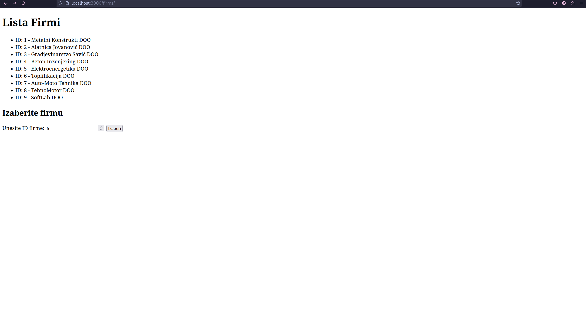

# PDF Invoice Generator

This project implements a PDF invoice generator using **Ruby on Rails** and the **Prawn** library. It enables users to manage company and product data and generate professional PDF invoices.

---

## Features
- **Company Management**: Add, view, and select companies.
- **Product Management**: Add, view, and select products with quantities.
- **PDF Generation**: Automatically generate PDF invoices based on selected companies and products.
- **User-Friendly Interface**: Simplified navigation and data selection.

---

## Technologies Used

### Backend
- **Ruby on Rails**: MVC framework for web application development.
- **SQL**: Database operations for companies and products.

### Frontend
- **HTML**: Structuring web pages.
- **Embedded Ruby (ERB)**: Templating for dynamic content rendering.

### PDF Generation
- **Prawn Library**: Creating and formatting PDF documents.

---

## Setup Instructions

### Prerequisites
- Ruby (v3.2.0 or newer)
- Rails (v7.2 or newer)
- MySQL (or compatible database)

### Installation
1. Clone this repository:
   ```bash
   git clone <repository-url>
   cd <repository-folder>
2. Install dependencies:
   ```bash
   bundle install
3. Configure the database:
   Edit config/database.yml to match your database credentials.
   ```bash
   rails db:create db:migrate
4. Start the Rails server:
   ```bash
   rails server
5. Visit the application at http://localhost:3000.

## Application Structure

### Models
- **Firma**: Represents companies.
  - Fields: `id`, `pib`, `naziv`, `adresa`, `telefon`, `mail`
- **Proizvod**: Represents products.
  - Fields: `id`, `sifra`, `naziv`, `cena`, `JM`

### Controllers
- **FirmsController**: Handles company-related actions.
- **ProizvodiController**: Handles product-related actions and PDF generation.

### Views
- **firms/index.html.erb**: Displays company data.
- **proizvodi/index.html.erb**: Displays product data with selection options.

### PDF Service
- **FakturaPdf**: Uses Prawn to generate PDF invoices with details about the selected company and products.

### Routes
- `/firms`: List and select companies.
- `/proizvodi`: List and select products to generate invoices.

## How to Use

### Add Data
- Navigate to the `/firms` route to manage companies.
- Navigate to the `/proizvodi` route to manage products.

### Select Company
- Use the company list to choose a company for the invoice.

### Select Products
- Choose products and specify quantities.

### Generate Invoice
- Click the "Generate Invoice" button to download the PDF.

## Example




## Future Improvement

## License

This project is licensed under the MIT License. See the LICENSE file for details.
